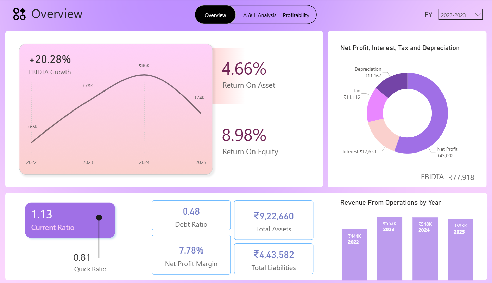
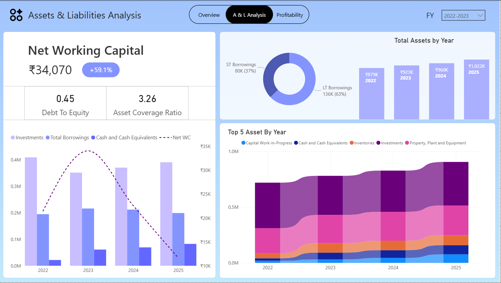
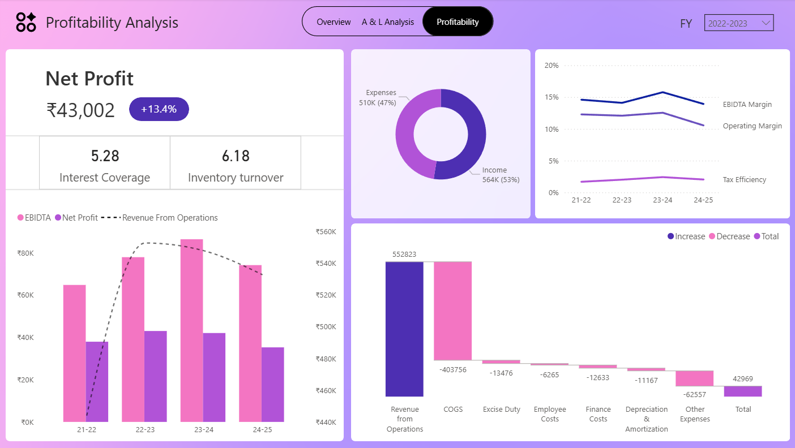

<table border="0">
  <tr>
    <td width="120" valign="center">
      
    </td>
    <td valign="top">
      <h1>Financial Statement Analysis Dashboard</h1>
      
A dynamic Power BI project transforming raw Balance Sheet and Profit & Loss Statement data into a strategic decision-making tool.

    </td>
  </tr>
</table>

## 📊 Dashboard Previews

### 1. Executive Overview
Focuses on high-level health metrics like **ROE** and **ROA**. It features an interactive EBIDTA growth trend to monitor year-on-year performance.

### 2. Assets & Liability Analysis
A deep dive into capital structure. This page tracks the **Net Working Capital**  and uses a ribbon chart to visualize the composition of the Top 5 Assets over time.

### 3. Profitability Analysis
Utilizes a **Waterfall Chart** to bridge the gap between Revenue and Net Profit, highlighting major cost drivers like COGS and Other Expenses.

---

## 🛠️ Technical Stack & Skills
* **Data Modeling:** Star Schema design with dedicated Fact and Dimension tables.
* **DAX (Data Analysis Expressions):** Created complex measures for:
    * *Time Intelligence:* YoY Growth and Moving Averages.
    * *Financial Ratios:* Current Ratio, Debt-to-Equity, and Inventory Turnover.
* **Power Query (M):** Data cleaning, unpivoting financial categories, and handling multi-year data consolidation.
* **Data Visualization:** Custom themes, conditional formatting for KPIs, and interactive slicers.

## 📂 How to Use
1.  **Clone the Repo:** Download the [FS Analysis.pbix](./FS%20Analysis.pbix) file.
2.  **Open in Power BI:** Best viewed with Power BI Desktop.
3.  **Interact:** Use the **Year Slicer** (Top Right) to filter. Note: Historical trend charts are designed to remain static to provide long-term context.

 

*Created by [Vedang Singh](https://github.com/Vedang-Singh)*
